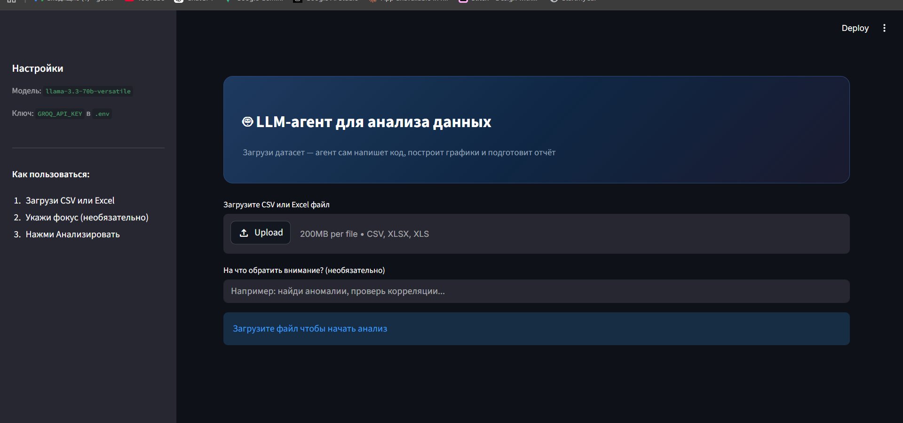

# Задание 3 — веб-приложение с LLM-агентом (Streamlit + Gemini)

Приложение позволяет загрузить CSV/Excel, затем LLM генерирует Python-код (pandas/matplotlib) для анализа, код выполняется локально в безопасной временной папке, после чего показывается итоговый отчёт и построенные графики.

## Интерфейс



## Установка

Из корня проекта:

```bash
py -3 -m pip install -r task3/requirements.txt
```

## Ключ API


Ключ берётся из `.env` в корне проекта:

В `.env` укажите:

`GROQ_API_KEY=...`


Где взять ключ:
- Откройте `https://console.groq.com/`
- Войдите или зарегистрируйтесь в аккаунте
- В меню слева выберите **API Keys**  → **Create API key**
- Скопируйте созданный ключ и вставьте его в файл `.env`

## Запуск

```bash
python -m streamlit run task3/app.py
```

